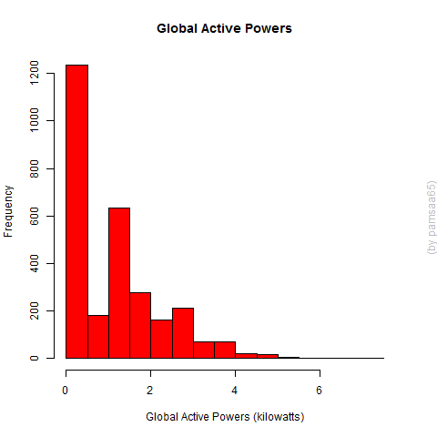

## Introduction

This assignment uses the "Individual household electric power consumption Data Set" from the <a href="http://archive.ics.uci.edu/ml/">UC Irvine Machine Learning Repository</a> 
* <b>Dataset</b>: <a href="https://d396qusza40orc.cloudfront.net/exdata%2Fdata%2Fhousehold_power_consumption.zip">Electric power consumption</a> [20Mb]

The descriptions of the Dataset are in the <a href="https://archive.ics.uci.edu/ml/datasets/Individual+household+electric+power+consumption">UCI web site</a>

The dataset has 2,075,259 rows and 9 columns. We will only use data from the dates 2007-02-01 and 2007-02-02. 

## Scripts

There are five scripts: one for each plot (plot?.R), and 
one script with common sentences for load, select and transform data (loadData.R)
Each plot script uses load data script (with source()).

## Plots

The four plots that are constructed are shown below

### Plot 1
 

### Plot 2
 

### Plot 3
 

### Plot 4
 

## Run the scripts:

* Download the scripts loadData.R y plot*.R to working directory
* Download the data file from web and unzip into ./data subdirectory 
* Run the scripts